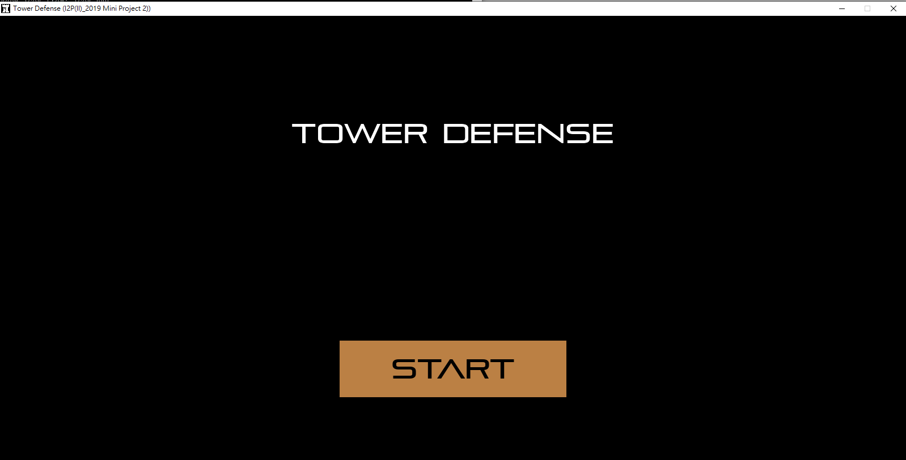
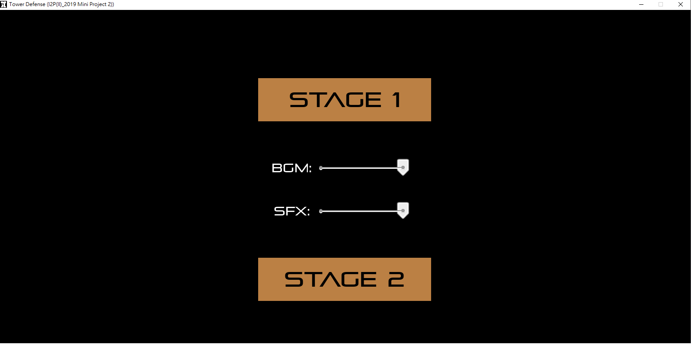
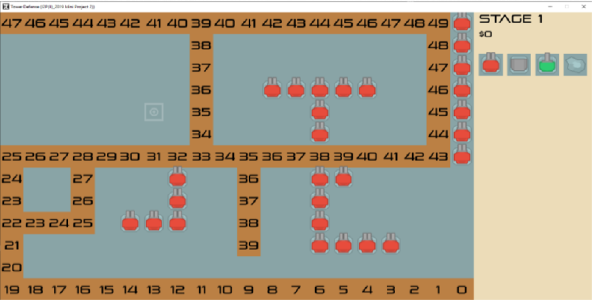
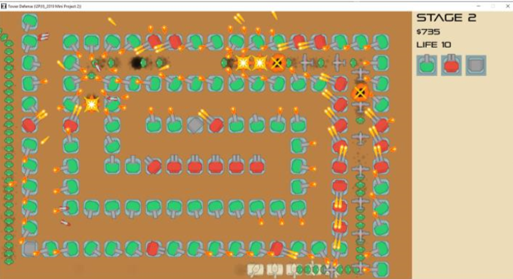
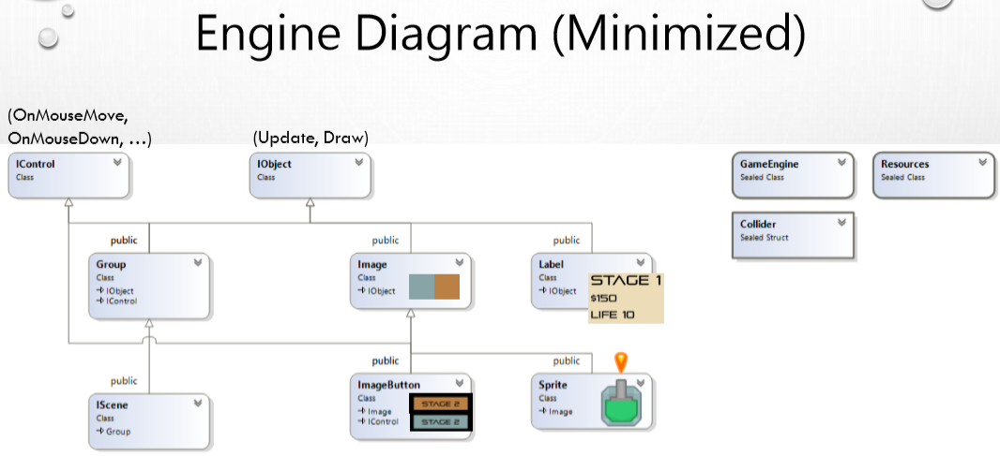

# project2_tower_defense                                                                                                                                                                                                                                             
                                                                                                                                            
### 環境架設使用allegro5 跟 C++11。                                                                                                              

### 利用物件導向來實作這個塔防遊戲(Towerdefense.cbp)。                                                                                                          

### 遊戲內容與控制: 
1. shiift + enter 為金手指。                                                                                                                 
2. tab 為顯示地圖數字。(BFS)                                                                                                                          
3. 內含音樂以及聲音大小控制、射擊音效、不同地圖...等等。

### ---------------------------------------------------------------------------

此遊戲初始會給予小額的金錢購買低耗費的砲塔，
隨著擊殺敵人的士兵後，
可以獲得金錢購買更高價的砲塔，
若是敵人走道地圖的末端，
代表遊戲結束 Gameover，
反之敵人全被擊敗 為win game。 

### 遊戲內容部分圖片

